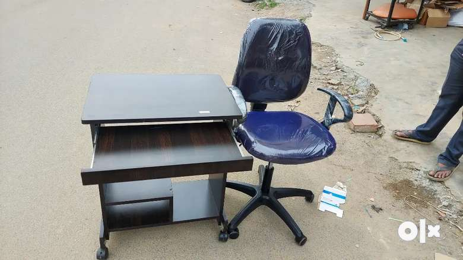
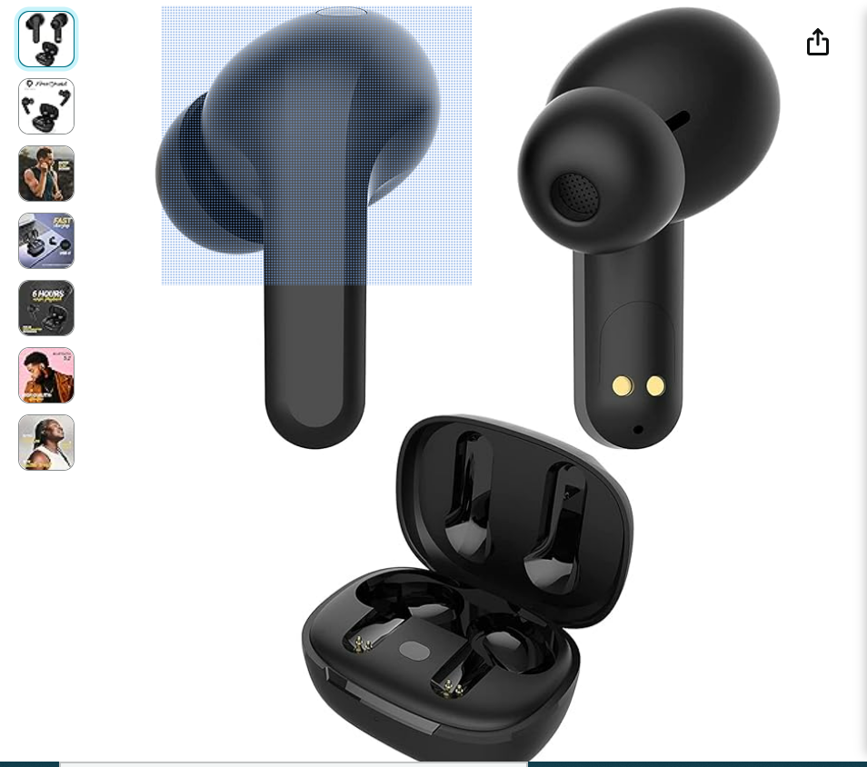

# Guidance_Repo
A simple for providing a guidance for all parents, kids and adults in India

# Please read this webpage before taking any decisions in your life

A simple repo for providing guidances for all the kids, adults and parents in India

# My Thoughts
- This web page is only for providing my expierence to other people. I am not responsible for your any decisions/your any actions in your life based on this web page informations.
- I am not recommending any application for money here as well.
###### Please read this page once in a week, please also make your kids to read this page once in a week.
###### Please do share this web page with anyone, anybody can benefit from all this informations.
###### I will update this web page whenever I have new information/missing content is found.
## Life
- Life is not too short, You will have until 60/70 years.
- Always learn from other people
- Always learn from your mistakes
- First know the world and how it works
- One should learn multiple languages such as Hindi/English in life, Use youtube to learn languages
- Learn English here on youtube [https://www.youtube.com/@engvidRebecca]
- Learn Hindi here [https://www.youtube.com/@hindipod101/videos]
- One should know how to use mobile phones and different applications
- One should know how to use laptop
- One should know the useful legal laws
- One should know how to drive Bike/Car
- Learn to speak slowly
- Do not get into any business/things without having a basic knowlegde
- Mnd your business in life
- One should learn about how to be selective in life
### Family
- Family is everything in life such as parents, sisters, brothers

### Friends
- Always be with good friends
- Learn good things from other friends

### Social life
- you should know the value of social life
- Social life helps you to know the value of relationships 
trust, value of life
- Please engage with people everyday

### Chain of effects in life
- will be added with diagram

### Discipline
- 
### Personality

### Minimalistic
- The meaning of minimalistic is to having only needed things in life
- Minimalistic says that "One should buy only needed/essential things in life"
- An example for minimalistic is to having a car worth of 10 Lakhs for your use and for your family. Minimalistic does not say to buy a car worth of 1 Crore for your family use, when you are earning a 10 lakhs per year.

### Education
- Please do not expect your kids to be a topper
- Please always focus that your kids should have basic education such as Bachelor degreee to get a Job/ be eligible for government exams
- Please remember that Education is just one of the essiential part of today's life along with water, Air, clothes and food
### Ethics
- Please teach your kids to respect elders
- Please teach your kids to know the value of honesty, trust
- Please teach your kids to know the importance of keeping a relationships(either father-son relationships, mother-daughter relationships, business-partner relationships)
### Money
- Please teach your kids the value of money, which means how the money should be spent
- Please teach your kids how to track expenses in their life
- Never ever buy/give everything for your kids, so that you should make them to learn/know the importance of being not having something/everything in their life.
- One can earn money at any age, but not health, education or relationships
- Learn what is inflation?
- How money works
- What is economy?
- Use application to track your spending and earnings https://goodbudget.com/ for free
### Other activities for your kids
- Music class, dance class, drawing
- Swimming
- cricket/badmiton/running
- Learn/teach your kids the Hindu Mantras, for an example like this one https://open.spotify.com/playlist/4DrHUz8VRzlKlLG5qut0Cz?si=e3b6e904dd6a4e9d
- Allow/Teach kids to think about their actions/thoughts everyday for one hour
- Kids should sleep enough for at-least 8-9 hours per day on weekdays, on weekends/holidays in the afternoon as well.
### Patience
- Please teach your kids to have a patience in their life through yoga, meditation, sports
- Patience helps kids/anyone to think logically during difficults times and help to take proper decisions
- Patience helps to navigate difficult situations in life and dealing with other people in life
## Education
- Education is just a part of five essentials in our life such as Air, Food, Water, Clothes
- Learn the importance of education
- Never ever memorize anything, understand the things first and work on them
- 
### Education for Government jobs 
#### After 10th
- If you are confident enough to clear Science, then take PCMB for Medicine/Engineering, PCMC only for engineering/BBA/BCA
- You can take commerce/Arts only for government jobs
- Another option is Diploma in Engineering, then take Diploma in Computer Ccience/Electronics/Electrcial/Civil
- For Medical and Engineering degree, you need to take CET coaching so that you might can try for better ranking.
#### After PUC
- Bachelor of Science - B.Sc.
- Bachelor of Arts - B.A
- Bachelor of Commerce - B.Com.
- Bachelor of Business Administration - B.B.A.
- Bachelor of Education - B.Ed.
- Bachelor of Laws - L.L.B.
- Bachelor of Physical Education - B.P.Ed.
- Bachelor of Fisheries Science - B.F.Sc./ B.Sc. (Fisheries).
- Bachelor of Forestry
- Bachelor of Science Agriculture - B.Sc.AG
- Bachelor of Horticulture - B.Sc. Horticulture
- Bachelor of Veterinary Science & Animal Husbandry - B.V.Sc. & A.H. / B.V.Sc
- Bachelor of Engineering / Bachelor of Technology - B.E./B.Tech.
- M.B.B.S -----> Need Good rank in KCET
#### After Degree 
- Please ask other people if you have no one to guide what to do next so that you will have better understanding of jobs and future studies
- You can also do/get some coaching/certificates to get jobs in Engineering sector after your B.Tech.
- You can join a private company and prepare for government jobs, while working as a teacher/contractual government jobs/group C/Group D governement jobs
#### The main purpose of doing Post-graduate is to prepare for goverment exams during Master studies, so that you will get money from Government as a stipend and you will have more time to prepare for good private jobs
- Master of Science Agriculture - B.Sc.AG
- Master of Arts - M.A.
- Master of Commerce - M.Com.
- Master of Dental Surgery - M.D.S.
- Master of Education - M.Ed.
- Master of Engineering / Master of Technology - M.E./ M.Tech.
- Master of Science - M.Sc.
- Master of Veterinary Science - M.V.Sc.
### Education for Private/Engineering Jobs
- For private jobs in India especially in Engineering, you just need technical skills and soft skills.
- Soft skills https://www.thebalancemoney.com/what-are-soft-skills-2060852#:~:text=Soft%20skills%20include%20interpersonal%20(people,for%20just%20about%20every%20job.
- You can improve/gain technical skills via Udemy  application https://www.udemy.com/
### Exams
- There are lots of government jobs for engineering degree holder in Civil/Electrical/Mechanical
## Government Exams and Jobs
- Please read below website to know about how to prepare for government exams
- https://medium.com/@crazyboysonushri/how-to-find-a-government-job-in-india-8b6ef5054f3c
- You just need Bachelor Degree to give any government exams in India/State
- Always get coaching for any government jobs at-least 6 months full-time/part-time and then preapre for the exams for yourself
- Getting coaching for exams gives you a better understanding of exams preparation and exams structure
- If your main focus is governement jobs, please take simple degree/master degree and prepare for government exams
- You need to take care of your financial things while preparing for government exams, so I recommend to have a simple job while preparing for government exams
- You also need soft skills for government jobs https://www.thebalancemoney.com/what-are-soft-skills-2060852#:~:text=Soft%20skills%20include%20interpersonal%20(people,for%20just%20about%20every%20job.
## Private Jobs in Inida
- Please have a account on LinkedIn 
- You should know how to search for private jobs in India
  * Visit Individual company websites
  * Search on LinkedIn, Naukri, Indeed and others
- Engineering
- Accountant and others
- Please do own research
  
### Business
- Do your own research on this topic
## Mindsets
- You should always give some time in a day at-least 30 minutes to think about your life, your actions, your future goals,
- You should not compare your life with other people
- You have your won strength/individuality, focus on those things
- You should learn to control your emotions
- You should learn to understand things and dealing with other people such as parents, friends
- You should know your responsibilites in your life, your goal always
- Improve your confidence, appearances, way of talking(please do online search for help)
- Come out of the loop that someone will help you/someone is there for you to help always please suri
## Mental and Physical Health
### Mental Health
- You should learn to keep good mental health
- Please do yoga and meditation for at-least 30 mintues a day, 20 minutes for yoga and 10 minutes for meditation
- Yoga and meditation improves your mental health
- Yoga and meditation improves focus, concentration
- Yoga and mediation improves decision making skills and thinking ability
- Yoga and mediation improves your patience level
- If you have problem to sleep, please do physical activities such as running, work out in the evening for 1 hour
- Please do not think about anything before two hour of sleeping
- If you have problem, please share with someone close to you such as brother, sister, parents, friends, it will relieve your mind
- please do yoga and meditation in the evening between 5 pm and 8 pm in a open room
- For yoga and meditation, you can take coaching for thr first time for 3 months in-person/online
### Physical Health
- Always eat fruits, vegetables instead of junk food
- Do physical activites everyday for at-least 1 hour such as walking, jogging, playing sports
- 
## Studying in abroad
- Doing higher stuides in abroad does not bring too much into your life, if you have more responsibilities in your life/ have an idea to do your own business
- I would not recommend anyone to go and study higher education in any developed countries, because it does not bring anything in your life
- Instead focus on improving your skills and preapre for any government exams for at-least 3-4 years
- 
## Others
### How to keep your study environment
- Always have a plan for your studies every day 
- Always study for one/ one and half hour and take 10 mintues break/ go for a small walk outside/on top of your house
- Do not study in dark room
- Always study under proper sun light/big room
- Always have a good study table and chair for each person like below
-  .
### How to study
- Do not memorize anything, understand the concepts and format the concepts in your own words
- Do not memorize mathematics, mathematics needs to be pratice with work sheets
- Mark/High lights important things in your text books with highlighters
- Underline important things/sentences/lines in your text books
- Listen music for better focus while studying if needed on Spotify application (https://open.spotify.com/)
- https://open.spotify.com/playlist/1ILN6NiSwe9pmz0u7HJ67y?si=c78e2727799346b8
- You can also listen to music when you are bored/alone
- You can also listen to English/Hindi Podcast here
- Buy headsets like below
- 
### Health
- Drink one glass of water after your tooth brush in the morning
- Rinse your eyes(Hold the water in your both hands and open your eyes in the water) in the morning and evening everyday
- 
### Travelling
- If you feel bored/ tired of life, you for hiking/trip with friends or solo for 2/3 days

### Cloud 
- Future is data, you need to know how to store your data on cloud
- You can use free cloud service on phone/laptop such as google cloud in your gmail, micro-soft cloud for free
- You can also use Github for free on phone/laptop to store your work/data, https://github.com/
 * You can use Github in a simple steps, it is very helpful and free tool
 * In Github, create a Repo  and make the Repo private in Visibility
- Always create a folder for each topic in your cloud and store the data under that folder, see below for an example
- 
- Like above create a folder your Family/Personal and store the data only related to those folders
- You can keep all your text books in cloud/Github for free for future purpose

### Planning
- Always plan in your life

### Readings
- Always read book about life/finance/Management/Technical
- You can save your online books in Github as well
- You can write everything in your life/your planning for a day in the below applications
- Use microsoft To-Do applications for free for planning (https://to-do.office.com/tasks/)

### Decision Making
- if you want to make any decision in your life please follow below approach
- Go out for a walk and free your mind first
- never ever take any decisions in urgent
- never ever take any decisions when you are happy/sad
- while walking think about pros and cons of your decision
- talk to someone( family member/friends/stranger) about your thoughts process for your decision 
- write down your thoughts and pros and cons of your decisions process
- Get more information about your decisions 
- Do proper research once again
- revisit your thoughts before finally agreeing with it

### Skills
- Use Udemy https://www.udemy.com/ for learning new skills in your life, you need to pay for it
- You can also bookmark all the important web pages on google chrome including this page! like below
  ![chrome_bookmark](Chrome_bookmark.PNG]

### Profession
- Everyboday wants to save their ass and life, so be careful while dealing with people
- Please be cautious about your life
- No argument with anyone
- People change company for growth /better pay or better work/better life
- Work only between 8-5 ro 9-6, no extra work
- Do not think that you have to do everything on your own and company will not run without my work
- You should know how to work with old and young people in life and behave/deal with old and young people

### Responsibilities
- You should know your responsibilites in your life first such as financial, home and parents
- Take care of your finance for your future and your family future
  
### Pwer of Music
- Know the power of music while studying/Working/bored/depressed/alone/loneleness
- Read below web page to know more about power of music
- https://medium.com/@bhagat_16083/the-power-of-music-and-its-impact-on-society-522cdf55c456#:~:text=Listening%20to%20the%20popular%20playing,even%20help%20them%20through%20depression.
  
### Dealing with people
- Not all the people on earth are good, similary, not all the people are bad
- You should know how to distinguish between good and bad people
- People use mind-game  to manipulate others, so be aware of it
- Always stay away from any financial things with other people/strangers
- People will be nice when taking money from you, afterwards, people behave stangely.

### Problems
- World problems are not your problems, keep in mind
- Your problems are only your problems, keep in mind

### Networking
- Please be connected with likely minded people everyday always
- Networking gives you more knowledge than anything

### Mood swing
- There is a great pro-verb in English. "Your mood is depending on Weather"
- Nowadays, your mood is also depending on the people you live/work.
- One should know how to control mood swing in life
### Addictions
- Control your emotions so that you will not be addicted to anything such as Smoking/drinking/other things
- If you feel that you are addicted/being addicted to anything, start doing activites to get rid of addictions
